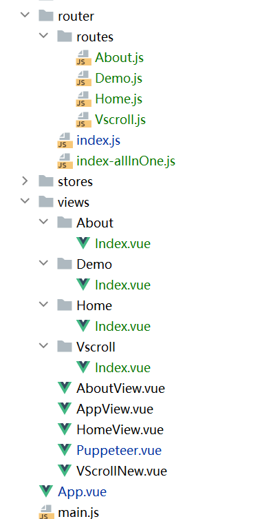

### 2024-05-22
路由-页面模块改造   

改造前：所有路由位于router-index

```js
import {createRouter, createWebHistory} from 'vue-router'

const router = createRouter({
    history: createWebHistory(import.meta.env.BASE_URL),
    routes: [
        {
            path: '/',
            name: 'home',
            component: () => import('../views/AppView.vue')
        },
       {
            path: '/demo1',
            name: 'demo1',
            component: () => import('../views/demo1.vue')
       }
       //...
    ]
})

export default router

```

改造后：

```text
动态导入路由文件
const files = require.context('./routes/', true, /\.js$/);  
const routes = files.keys().map(key => {  
  // 去除 './' 和文件扩展名  
  const routePath = key.replace(/(\.\/|\.js)/g, '');  
  // 使用require动态导入路由模块  
  return files(key).default;  
});  
  
const router = new VueRouter({  
  routes  
});  
  
export default router;

```

### 2023-04-17
添加mock支持
```js
// vite.config.js
config.VITE_USE_MOCK === 'true' && plugins.push(
        viteMockServe({
            supportTs: true,
            logger: false,
            mockPath: "./mock/" // 注意文件位置
        })
    )
```

```text

// demo集合
HelloWorld.vue

// 解决的问题
1.项目中使用css
1.1 如何解决css变量，全局变量引入？
 方法一：全局:root伪类+var()函数
 :root {
    --bg-color: #1e90ff;
    --font-color: #cccccc;
    --BG-color: red; // 注意大小写敏感
    --url:url("https://picsum.photos/id/1/200/300");// 注意：不可以直接存储 urls
}
引入：
color: var(--font-color)
注意： App.vue style不可以加scope,否则：root不生效


方法2：
局部引入v-bind：
<script setup>
const color = 'red'
</script>
<style scoped>
  .p1{
    color:  v-bind(color);
  }
</style>

方法3：使用less
vite.config.js引入全局变量或函数
 css: {
    preprocessorOptions: {
        less: {
            modifyVars: {
                hack: `true; @import (reference) "${path.resolve("./src/assets/less/base.less")}";`,
            },
            javascriptEnabled: true,
        },
    },
},
页面使用：
 .aa{
  font-size: 18px;
  color: @primary-color;
  .bordered();
  .border-radius(5px);
}


1.2 防止CSS样式全局污染
1 <style scoped>
//...
</style>

2. 组件传递
defineProps使用

3. watch使用

4.路由跳转与参数获取

5.Teleport使用

6. pinia使用
state使用：
store.$patch({
  counter: store.counter + 1,
  name: 'Abalam',
})
getters使用；

'modules'使用；

actions使用；
注意pinia内不能写出action

7.添加axios请求案例

```

## 集成功能
```js
css换肤
虚拟滚动

```


# vue-admin
This template should help get you started developing with Vue 3 in Vite.

## Recommended IDE Setup

[VSCode](https://code.visualstudio.com/) + [Volar](https://marketplace.visualstudio.com/items?itemName=Vue.volar) (and disable Vetur) + [TypeScript Vue Plugin (Volar)](https://marketplace.visualstudio.com/items?itemName=Vue.vscode-typescript-vue-plugin).

## Customize configuration

See [Vite Configuration Reference](https://vitejs.dev/config/).

## Project Setup

```sh
pnpm install
```

### Compile and Hot-Reload for Development

```sh
pnpm dev
```

### Compile and Minify for Production

```sh
pnpm build
```
